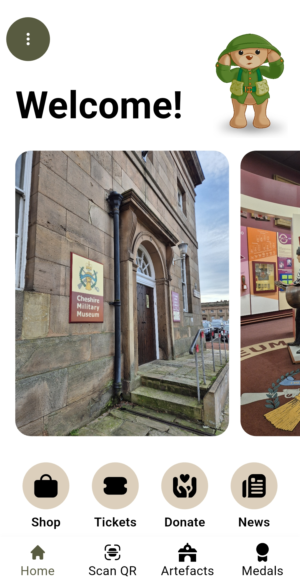
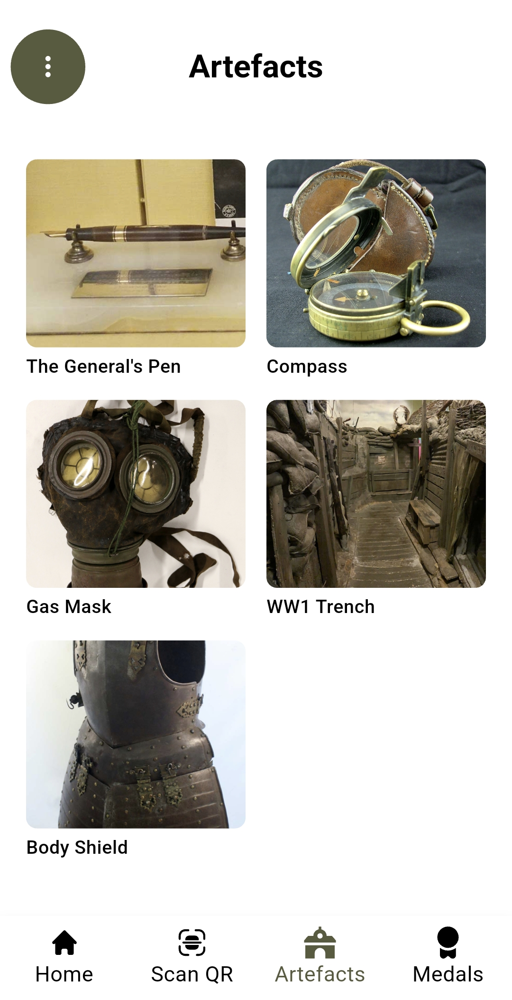
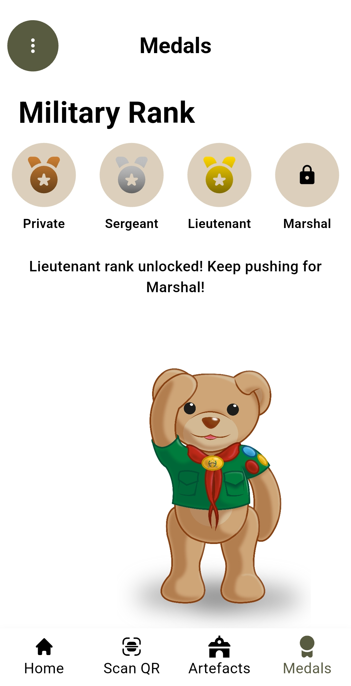

# 🏛️ Cheshire Military Museum Project

## Overview

The **Cheshire Military Museum Digital Experience** project enhances visitor engagement through an interactive mobile app and a supporting web-based admin panel.

This system bridges the gap between historical education and digital interactivity — allowing visitors to explore, discover, and collect artefacts around the museum using **QR codes**, while staff can manage and update content seamlessly through an online interface.

---

## 📱 Project Components

### **1. CMM-App (Flutter)**
A cross-platform mobile app built with **Flutter**, compatible with both Android and iOS.

**Key Features**
- 🗺️ Explore museum exhibits digitally  
- 📸 Scan **QR codes** placed around the museum to "collect" artefacts  
- 🏅 Earn **medals** based on the number of artefacts collected  
- 🎮 Gamified experience designed to increase visitor interaction and learning  

**Preview**
| Home | Artefacts | Medals |
|------|------------|--------|
|  |  |  |

---

### **2. CMM-Admin (.NET Web App + API)**
A web-based **admin panel** built using **ASP.NET Core** that allows museum staff to:

- 🧭 Manage the collection of artefacts  
- 🧾 Generate **QR codes** to display around the museum  
- 🌐 Sync artefact data with the mobile app via a secure API  

---

## 🛠️ Tech Stack

| Component | Technology |
|------------|-------------|
| Mobile App | Flutter (Dart) |
| Admin Panel | ASP.NET Core (C#) |
| Database | Microsoft SQL Server |
| API | RESTful Web API |
| Platform | Android & iOS |
| Tools | Visual Studio, Rider, Postman, Git |

---

## 🚀 Deployment

### **1. Admin Panel**
To deploy the admin system, follow the setup instructions in  
[`/CMM-Admin/README.md`](./CMM-Admin/README.md)

### **2. Mobile App**
To deploy or run the mobile app, follow the setup instructions in  
[`/CMM-App/README.md`](./CMM-App/README.md)

> ⚠️ Note: Some app features (such as artefact scanning and medal tracking) require the admin API to be deployed and accessible over the internet.

---

## 🌐 Connectivity

- Basic app features (like static museum information and links) work offline.  
- **QR code scanning and collection** features require an **active internet connection** to communicate with the admin API.

---

## 🧩 Future Improvements

- Add in-app map navigation  
- Introduce user profiles and leaderboards  
- Enhance accessibility features  
- Offline caching for QR and artefact data  

---

## 🏁 Summary

This project transforms a traditional museum visit into a **gamified digital journey**, encouraging exploration, discovery, and engagement through technology — blending history with innovation.

---
